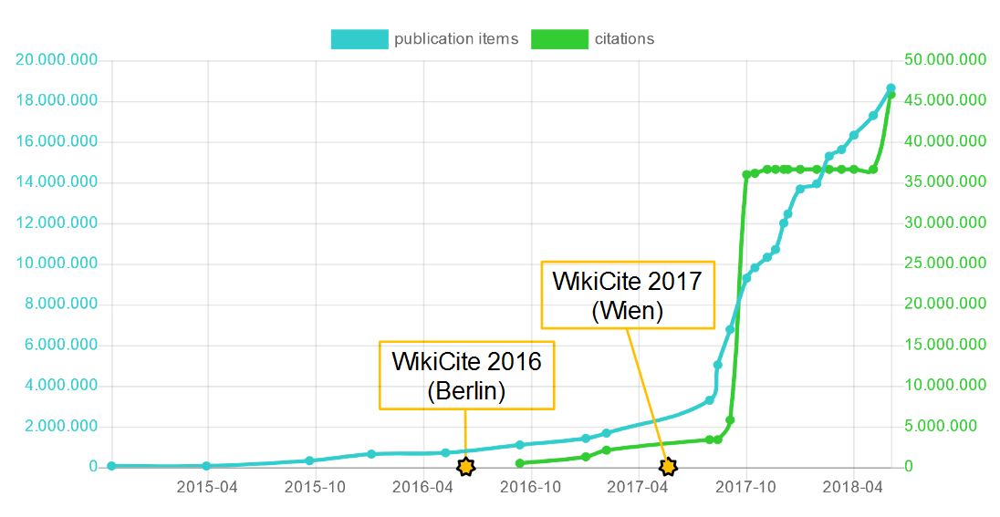

# Einführung & Motivation

## Was ist WikiCite?

* Kontext: Wikipedia, **Wikidata**, Wikisource...

## Ziele von WikiCite

* Freie bibliographische Datenbank in Wikidata
    * Bibliographische Metadaten
    * Zitationsdaten

* Katalogisierung selbstständiger + unselbständiger Werke + Beziehungen
    * kollaborativ (Social Cataloging)
    * offene Daten (CC0)

## Umfang

* 17/48 Millionen Wikidata-Einträgen zu Publikationen
* 36/440 Millionen Aussagen in Wikidata sind Zitationen

{height=70%}

## Motivation für Wikipedia

* Aussagen mit Belegen versehen
* Bibliographische Metadaten zentral für alle Artikel und Sprachversionen

{width=80%}

{width=30%}

## Motivation für Wikidata

* Fakten in Wikidata mit Fundstellen belegen

## Motivation für bibliometrische Auswertungen

<!-- https://tools.wmflabs.org/scholia/organization/Q1269766 -->

## Motivation für bibliometrische Auswertungen

<!-- https://tools.wmflabs.org/scholia/topic/Q202864#Co-author%20graph -->

# Umsetzung von WikiCite

---

{width=100%}

## Wikidata-Datenmodell

* Item-Identifier 
    - [http://www.wikidata.org/entity/**Q30000000**](http://www.wikidata.org/entity/Q30000000)

* Eigenschaften
    - **P31** *ist ein(e) / instance of / est ...*
    - **P50** *Autor / author / scriptor ...*

* Datenmodell ist dynamisch
    - Neue Eigenschaften vorschlagen, diskutieren und erstellen

## Tools zur Bearbeitung

* Direkte Bearbeitung auf <https://wikidata.org/>

* **sourceMD/fatameh** Import von Metadaten anhand DOI/Pubmed-ID
* **zotkat** Import aus Zotero (Literaturverwaltung)
* **Mix'n'Match** Abgleich von Normdaten mit externen Identifikatoren
* **OpenRefine 3.0** mit erweiterter Wikidata-Anbindung
* ...

## Qualitätssicherung

* Eigene Beobachtungslist für Wikidata-Einträge
    * Benachrichtigung bei Änderungen

* Einschränkungen von Werten von Eigenschaften
    * ISBN (P212/P957) folgen bestimmten Muster
    * Autoren (P50) müssen Personen oder Organisation sein

* Regelverletzungen werden protokolliert (constraint reports)\
  und können dann verbessert werden

## Normdaten-Verlinkung 

* Wikidata ist selbst eine universelle Normdatei

* Verknüpfungen mit externen Einträgen
    * DOI, ISBN, PMID, arXiv-ID, ... (Publikationen)
    * GND, VIAF, ORCID, dblp-ID, ... (Autoren, Organisationen...)
    * ... (Orte, Substanzen, Ereignisse...)

* 2824/4741 Wikidata-Eigenschaften dienen der Verlinkung mit anderen Datenbanken

## Abfragemöglichkeiten

* <https://query.wikidata.org/> (SPARQL-Editor)

* Beispielabfragen
    * Bücher zusammen von Elter(n) und Kinder(n) geschrieben:\
      <http://tinyurl.com/y7oe8uo8>
    * Autoren, deren Werke 2018 gemeinfrei wurden:\
      <http://tinyurl.com/yc8v6l9c>
    * Meist-zitierte Wissenschaftlerinnen:\
      <http://tinyurl.com/y8ell8nw>>
    * ...

# Perspektiven für Bibliotheken

## Bibliotheksdaten in Wikidata

* Wie können Bibliotheksdaten für Wikidata genutzt werden?
    * Verknüpfungen über externe Verweise?
    * Exportformate, APIs bereitstellen?

* sich bei Datenmodellierung einbringen?

## Katalogisierungstools

* Kann man Ansätze zum Datenerfassen in Wikidata auch bei der Katalogisierung in Bibliotheken adaptieren?

* Sind nicht auch stärker Tools für Bearbeitungen im Batch gefragt?

* Was ist mit Kontroll- und Prüftools?

## Umfang der Katalogisierung

* Aufsatzkatalogisierung
    * Thema für Bibliotheken? FIDs?
    * WikiCite zeigt auf, dass es möglich ist

* Katalogisierung von Zitationen
    * Können Bibliotheken zu offenen Zitationsdaten beitragen?
    * Zitationsdaten in Verbundkatalog speichern?
    * Linked Open Citation Database (LOC-DB)

# Fragen / Diskussion / Antworten?

## Weiterführende Links

* <http://wikicite.org>
* <https://www.wikidata.org/wiki/Wikidata:Identifiers>
* ...
